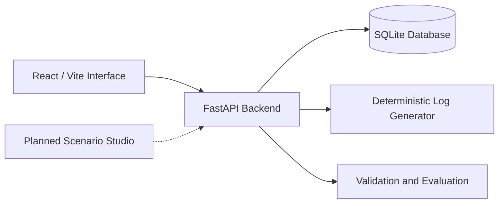
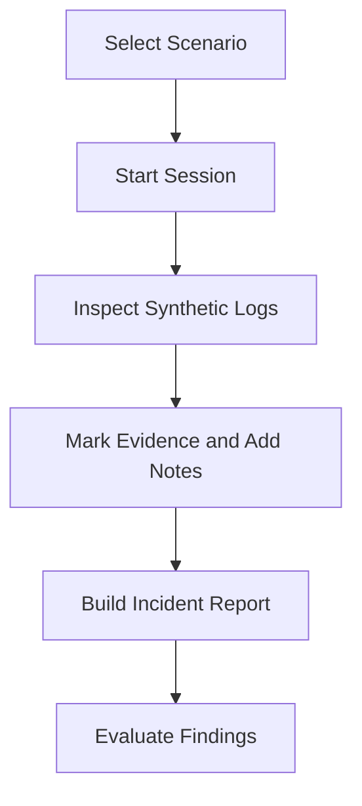
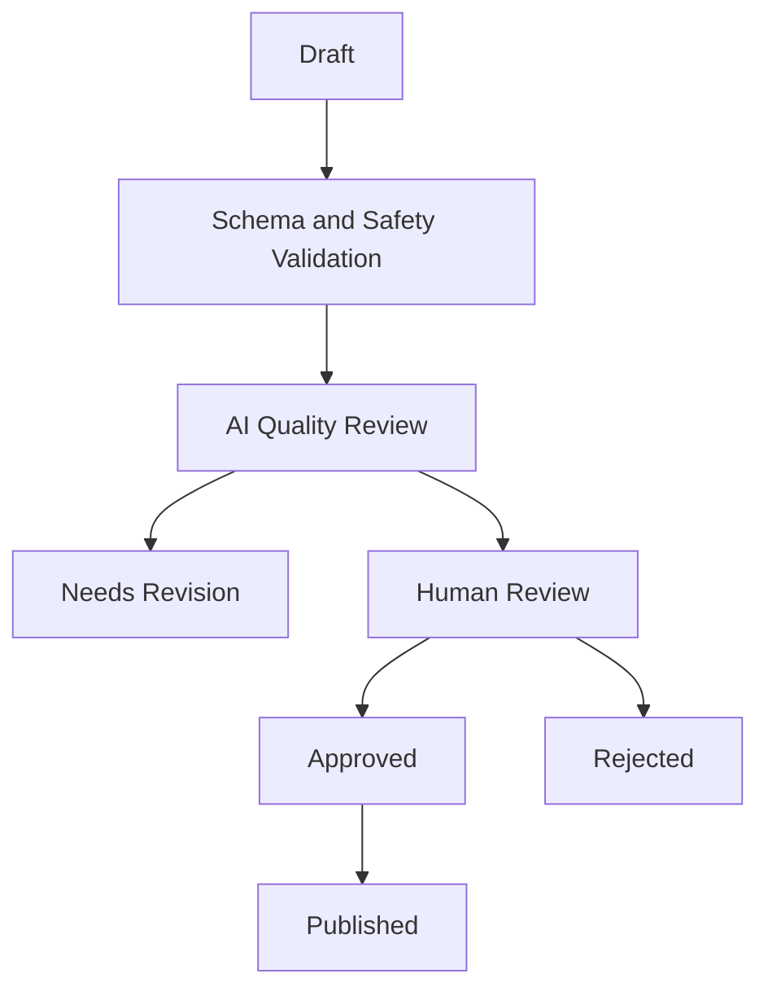

# CyberRange AI / AfterMath

## Adversarial SOC Investigation Simulator

> **Status:** In development

CyberRange AI is a portable, Docker-oriented training environment for Security Operations Center (SOC) investigations.

The platform gives learners incomplete and sometimes misleading synthetic security data. They must inspect logs, construct hypotheses, mark evidence, manage uncertainty, and produce an incident report.

The long-term project combines:

1. A deterministic SOC investigation simulator.
2. An AI-assisted scenario-generation and review system called **Scenario Studio**.

> **Important:** This is an active academic project. The repository implementation is the source of truth. Features marked as planned are not yet complete.

---

## Project Motivation

Traditional cybersecurity exercises often provide clean data and an obvious answer. Real SOC investigations are more complex:

- Evidence is distributed across multiple log sources.
- Events can be incomplete, noisy, or contradictory.
- Analysts must separate malicious activity from legitimate behavior.
- Findings must be supported by traceable evidence.
- Conclusions must be communicated under time pressure.
- Analysts need to manage false positives and uncertainty.

CyberRange AI is designed to train these analytical skills in a reproducible and safe environment.

---

## Core Simulator

The simulator is built around an investigation workflow:

1. Select a security scenario.
2. Start an investigation session with a time limit.
3. Inspect synthetic authentication, firewall, and audit logs.
4. Search for suspicious patterns and relationships.
5. Mark relevant events as evidence.
6. Add investigation notes and hypotheses.
7. Build a report referencing the supporting evidence.
8. Receive structured feedback and scoring.

The scenarios are synthetic and may contain:

- Realistic attack patterns
- Legitimate background activity
- Red-herring events
- Hidden evidence
- Multiple log sources
- Contradictory or incomplete information

The goal is to train reasoning and evidence-based analysis instead of simple pattern matching.

---

## Current Project Status

### Implemented Foundation

- FastAPI backend
- Pydantic request and response validation
- SQLAlchemy data-access layer
- SQLite persistence
- Deterministic synthetic log generation
- Scenario selection
- Investigation session management
- Timed investigation foundation
- Authentication, firewall, and audit-log inspection
- Evidence marking
- Analyst notes
- Report construction
- Evidence-reference validation
- React/Vite frontend prototype
- Docker-oriented project structure
- Initial scoring and evaluation foundations

### Currently In Progress

- Complete investigation workbench
- Improved investigation interface
- Expanded scenario support
- More detailed scoring and feedback
- Stronger automated tests
- Better documentation and reproducible setup

### Planned Features

- AI devil's-advocate conversations
- LLM-assisted grading
- Hint generation
- Scenario Studio
- Threat-intelligence integrations
- AI-generated investigation scenarios
- Automated scenario safety checks
- Automated scenario quality review
- Human approval workflows
- Isolated container-based training labs
- Community scenario submissions
- Multi-user deployment

> The current implementation does not yet contain a production LLM integration. AI-assisted generation, adversarial feedback, and advanced AI grading are planned extensions.

---

## Architecture



The current architecture prioritizes:

- Deterministic behavior
- Explicit validation
- Reproducible investigations
- Traceable evidence
- Safe synthetic data
- Clear separation between current features and future AI capabilities

---

## Technology Stack

| Layer | Technology |
| --- | --- |
| Backend | Python, FastAPI |
| Validation | Pydantic |
| Database access | SQLAlchemy |
| Database | SQLite |
| Frontend | React, Vite |
| Deployment | Docker and Docker Compose |
| Testing | Python tests, API tests, schema validation |
| Planned AI layer | LLM structured-output generation and review |
| Planned threat intelligence | NVD, MITRE ATT&CK, CISA KEV, FIRST EPSS |

---

## Investigation Workflow



Each investigation session acts as the boundary for:

- Session state
- Investigation time
- Log access
- Evidence selection
- Analyst notes
- Report construction
- Evaluation results

---

## Planned Scenario Studio

Scenario Studio is the planned content-generation subsystem for creating scalable, safe, and pedagogically useful SOC scenarios.

It will support two creation paths:

### AI-Generated Scenarios

An author will select:

- Investigation topic
- Difficulty level
- Threat-intelligence source
- Optional CVE identifier
- Optional MITRE ATT&CK technique

The system will then generate a fictional scenario containing:

- Scenario narrative
- Synthetic logs
- Learning objectives
- Expected evidence
- Red-herring events
- Hidden events
- Debate questions
- Evaluation rubric

### User-Submitted Scenarios

Users will eventually be able to upload or paste scenario JSON configurations.

Submitted scenarios will pass through:

1. Schema validation
2. Safety checks
3. AI quality review
4. Human review
5. Approval or rejection
6. Publication

User-submitted scenarios will always require human approval.

---

## Planned Scenario Review Pipeline



The AI must never publish a scenario without passing the required safety and quality controls.

The planned review states are:

```text
draft
pending_ai_review
needs_revision
pending_human_review
approved
rejected
published
```

---

## Threat-Intelligence Sources

The planned Scenario Studio will use public and structured threat-intelligence sources:

| Source | Intended use |
| --- | --- |
| NVD CVE API | CVE metadata, CVSS scores, descriptions, and references |
| MITRE ATT&CK TAXII | Techniques, tactics, procedures, and detection guidance |
| CISA KEV Catalog | Known exploited vulnerabilities and exploitation status |
| FIRST EPSS API | Exploit probability scores and percentiles |

The system is intended to use public threat intelligence as inspiration for synthetic training scenarios rather than copying real incidents or targeting real organizations.

---

## Safety Guardrails

CyberRange AI is designed for defensive education and safe simulation.

### Allowed Content

- RFC 1918 private IP addresses
- Documentation domains such as `example.com` and `test.local`
- Fictional company names
- Synthetic usernames
- Synthetic security logs
- Normal cybersecurity terminology
- Descriptions of attack behaviors for educational purposes

### Blocked Content

- Real victim organizations
- Personal data
- Real credentials or secrets
- Public target IP addresses
- Malware code
- Exploit payloads
- Credential-theft instructions
- Destructive commands
- Filesystem-wiping or disk-formatting commands

The system should distinguish between explaining an attack pattern and providing instructions to perform an attack.

---

## Quality Review Dimensions

The planned Scenario Studio will assess each generated or uploaded scenario across ten dimensions:

1. Realism
2. Learning-objective clarity
3. Expected-answer fairness
4. Evidence sufficiency
5. Red-herring balance
6. Difficulty calibration
7. Safety
8. IP-address validation
9. Log generability
10. Debate-question quality

A scenario should only move forward when it is safe, technically valid, realistic, and educationally useful.

---

## Evaluation Strategy

Evaluation is designed as a layered process instead of relying only on an AI-generated score.

### Current and Deterministic Checks

- Request and response schema validation
- Required-field validation
- Safety and input validation
- Evidence-reference validation
- Functional API tests
- Deterministic log-generation checks
- Reproducibility checks
- Basic investigation scoring

### Planned Evaluation

The academic evaluation will compare manually authored scenarios with AI-generated scenarios.

The formal project specification targets:

- One manually authored scenario
- Three AI-generated scenarios
- At least ten participants
- Comparison of learner performance across scenario types
- Evaluation of safety, realism, fairness, and pedagogical quality

---

## Example API Flow

The simulator uses versioned API endpoints.

A typical investigation begins by starting a session for a selected scenario:

```http
POST /api/v1/scenarios/{scenario_id}/start
```

The resulting session manages the investigation state, evidence selection, notes, report construction, and evaluation.

---

## Roadmap

### Simulator Core

- [x] Establish FastAPI backend foundation
- [x] Add deterministic synthetic log generation
- [x] Add scenario and session foundations
- [x] Add evidence and report-validation foundations
- [ ] Complete the investigation workbench
- [ ] Expand the scenario library
- [ ] Add AI devil's-advocate interaction
- [ ] Finalize advanced grading and feedback

### Scenario Studio

- [ ] Integrate NVD CVE API
- [ ] Integrate MITRE ATT&CK TAXII
- [ ] Integrate CISA KEV
- [ ] Integrate FIRST EPSS
- [ ] Normalize threat-intelligence data
- [ ] Add structured LLM scenario generation
- [ ] Add scenario draft editing
- [ ] Implement safety checks
- [ ] Implement automated quality review
- [ ] Implement review-state transitions
- [ ] Add human approval tools

### Deferred Product Roadmap

- [ ] Community scenario submissions
- [ ] Multi-user deployment
- [ ] Public scenario catalog
- [ ] Human moderation queue
- [ ] Broader isolated training labs
- [ ] Additional deployment options

---

## Local Development

### Prerequisites

- Python 3.11 or newer
- Node.js and npm
- Docker Desktop or Docker Engine
- Docker Compose

### Run with Docker

Replace the placeholders with the actual repository URL and directory name.

```bash
git clone <repository-url>
cd <repository-directory>
docker compose up --build
```

### Run the Backend Separately

```bash
python -m venv .venv
source .venv/bin/activate
pip install -r requirements.txt
uvicorn app.main:app --reload
```

### Run the Frontend Separately

```bash
npm install
npm run dev
```

The exact commands, service names, ports, and environment variables may change while the project is under development. Refer to the current project structure and Docker Compose configuration for the latest setup.

---

## Academic Alignment

The project is being developed alongside the following thesis topic:

> **AI-Assisted Generation and Validation of SOC Training Scenarios Using Public Threat Intelligence and Synthetic Forensic Logs**

### Research Questions

1. Can LLMs generate pedagogically sound SOC training scenarios from structured threat intelligence?
2. Which automated safety and quality checks are required to make generated scenarios realistic, fair, and safe?
3. Can adversarial AI feedback improve analytical reasoning compared with traditional grading?

### Bachelor-Level Scope

The initial academic scope focuses on:

- The simulator core
- One manually authored scenario
- Scenario Studio version 1
- AI-generated scenarios
- Safety and quality validation
- Comparison of AI-generated and manually authored scenarios

The following features are outside the initial thesis scope and are deferred to the product roadmap:

- Community publishing
- Multi-user deployment
- Payment systems
- Large-scale public moderation

---

## Design Principles

### Evidence Before Conclusions

Every important finding should be connected to specific observed events.

### Reproducibility

Deterministic synthetic data makes investigations easier to test, compare, and reproduce.

### Adversarial Reasoning

The learner should defend a hypothesis instead of only selecting a predefined answer.

### Safety by Construction

Generated scenarios must be validated, sanitized, and reviewed before publication.

### Human Oversight

AI can assist with generation and review, but human oversight remains part of the publishing process.

### Progressive Implementation

The working repository takes priority over proposed future architecture.

---

## Disclaimer

CyberRange AI is an educational defensive-security project.

It uses synthetic data and is not intended for:

- Attacking real systems
- Testing public targets
- Handling real credentials
- Processing real victim data
- Generating destructive or malicious payloads
